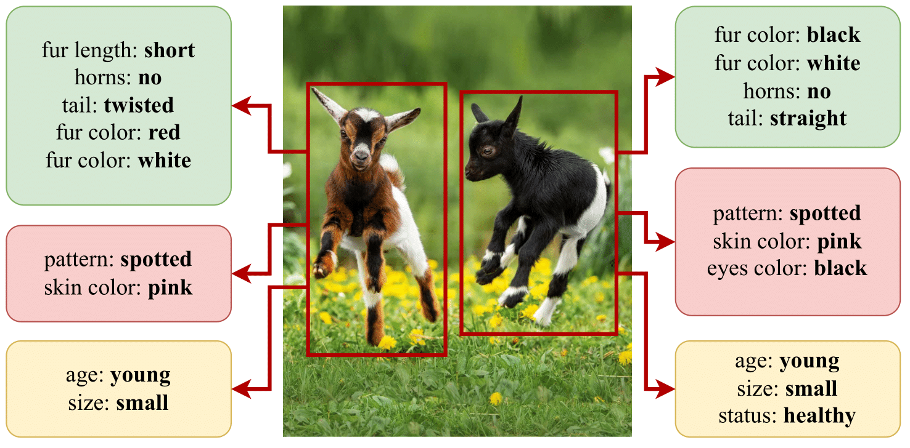

<div align="center">

<a href="https://www.python.org"></a>
<a href="https://pytorch.org/get-started/locally/"></a>

[](https://github.com/marco-garosi/ComCa)
[](https://alessandroconti.me/papers/2306.00917)

<div>

<hr />
</div>

[Marco Garosi](https://scholar.google.com/citations?user=BEIogS4AAAAJ),
[Alessandro Conti](https://scholar.google.com/citations?user=EPImyCcAAAAJ),
[Gaowen Liu](https://scholar.google.com/citations?user=NIv_aeQAAAAJ),
[Elisa Ricci](https://scholar.google.com/citations?user=xf1T870AAAAJ),
[Massimiliano Mancini](https://scholar.google.com/citations?user=bqTPA8kAAAAJ)

</div>

Attribute detection is crucial for many computer vision tasks, as it enables systems to describe properties such as color, texture, and material. Current approaches often rely on labor-intensive annotation processes which are inherently limited: objects can be described at an arbitrary level of detail (e.g., color vs. color shades), leading to ambiguities when the annotators are not instructed carefully.

<div align="center">

|       |
| :--------------------------------: |
| Examples of attribute annotations. |

</div>

Furthermore, they operate within a predefined set of attributes, reducing scalability and adaptability to unforeseen downstream applications. We present Compositional Caching (ComCa), a training-free method for open-vocabulary attribute detection that overcomes these constraints. ComCa requires only the list of target attributes and objects as input, using them to populate an auxiliary cache of images by leveraging web-scale databases and Large Language Models to determine attribute-object compatibility. To account for the compositional nature of attributes, cache images receive soft attribute labels. Those are aggregated at inference time based on the similarity between the input and cache images, refining the predictions of underlying Vision-Language Models (VLMs). Importantly, our approach is model-agnostic, compatible with various VLMs. Experiments on public datasets demonstrate that ComCa significantly outperforms zero-shot and cache-based baselines, competing with recent training-based methods, proving that a carefully designed training-free approach can successfully address open-vocabulary attribute detection.


# Setup

## Install dependencies

```sh
# Clone the project
git clone https://github.com/marco-garosi/ComCa
cd ComCa

# Create the virtual environment
# Ensure you are using Python 3.12.3
virtualenv venv
source venv/bin/activate

# Install the requirements
pip install -r requirements.txt
```


## Setup configuration variables

Rename `config_skeleton.py` to `config.py` and configure it according to your system.
Note that `config.py` is *not* committed to git, so it can be safely modified.
Specifically, variables refer to:
- `DIR_DATA`: images of the OVAD benchmark. The structure is already pre-filled, and only the base path has to be inserted. We refer to [the official repository](https://github.com/OVAD-Benchmark/ovad-benchmark-code) to properly set up the dataset.
- `BASE_PATH`: path to where this code lies.
- `RES_PATH`: you should ***not*** set it, as it is pre-defined.
- `OUT_PATH`: where to store the outputs. Note that evaluation scripts (`.sh` in the `scripts` folder) already set the output path, thus disregarding this setting.
- `DATASET_PATH`: path to the downloaded web-scale dataset. Note that you should report `base dataset path` here, as the script automatically adds the remaining part of the path, starting from `vocabulary_free`.
- `OPENAI_API_KEY`: your OpenAI API key. Pre-computed object-attribute scores are provided, so this is required only to run the script that generates them again.


```sh
# Copy the configuration file
cp config_skeleton.py config.py

# Edit the configuration file according to your system
vim config.py
```


## Download the pre-computed embeddings for CC12M

### Google Drive link

You can find resources to download for the next steps on [Google Drive](https://drive.google.com/drive/folders/1l7En7a0u4f-gKpR5BQ3592qlnedsCpYZ?usp=sharing).


### Explanation

You can use [clip-retrieval](https://github.com/rom1504/clip-retrieval/tree/main) to embed the dataset of choice for retrieval.
We provide pre-computed embeddings for the CC12M dataset to get you up and running much more quickly and avoiding potentially tedious setup procedures.

Download the pre-computed embeddings for the CC12M dataset.
The structure on the file system should look like:
```
base/dataset/path
|- vocabulary_free
    |- all_images
        |- cc12m
            |- *.npy
            |- *.pt
```

You may also download the `categories_*` tensors contained in the `OVAD` and `VAW` folders. They are used for experiments with IAP (indirect attribute prediction).

All experiments can be conveniently run via an `.sh` script. Each script defines a `base_path` variable, that is, where elements required by ComCa (including its own cache) will be stored. If they do not already exist, create a `comca-cache` folder under `base_path`, and create the `OVAD` and `VAW` folders within `comca-cache`.
Place the `categories_*` files under the corresponding `comca-cache` subfolder.


## Datasets

To download the OVAD dataset, we refer to the [official repository](https://github.com/OVAD-Benchmark/ovad-benchmark-code).
Once downloaded, you should place it under `$base_path/OVAD/ovad-benchmark-code/datasets/ovad_box_instances/2000_img` (refer to the next section for an explanation on `base_path`).
You should also set it up as explained in the official repository, thus cropping the images on each annotated object.
This should create two folders under the `2000_img` folder, `bb_images` and `bb_labels`. `bb_images` will contain the object crops.

For VAW, we refer to the [official repository](https://github.com/adobe-research/vaw_dataset).
You should download the Visual Genome images as explained in the official repository ([here](https://github.com/adobe-research/vaw_dataset?tab=readme-ov-file#download-images)).
In practice, this involves downloading images from part 1 and part 2 from [this website](https://homes.cs.washington.edu/~ranjay/visualgenome/api.html). Note that while VAW uses Version 1.4, images should be downloaded from the Version 1.2 section, as Version 1.4 provides no links.
Once downloaded, place all the images from both splits in a common folder: `$base_path/VAW`.


## Running

To run the experiments, you first have to construct the cache.


### Cache construction

If you have downloaded the pre-computed embeddings for CC12M, it should be quite straightforward.
Simply run:

```sh
# For OVAD
(venv) scripts/build_cache_OVAD.sh

# For SuS-X on OVAD
(venv) scripts/build_cache_OVAD_SuS-X.sh

# For VAW
(venv) scripts/build_cache_VAW.sh

# For SuS-X on OVAD
(venv) scripts/build_cache_VAW_SuS-X.sh
```

This might take some minutes, especially on VAW. At the end of the process, your `comca-cache` folder will contain all the necessary caches, stored as tensors, to conduct the experiments.
Note that some additional experiments, such as the image-based baseline, construct the cache on-the-fly, as storing it would take up too much space.


### Experiments

We can now run the experiments. To do so, you can run the corresponding `.sh` script, which takes care of (i) running the actual Python script and (ii) passing the right parameters.

For example, to run ComCa on the OVAD benchmark, you can issue the following command:

```sh
(venv) scripts/run_experiment_OVAD.sh
```

Note that every `.sh` script defines two variables, `base_path` and `cache_path`. By default, `base_path` is set to `"/mnt/data/ComCa"` and `cache_path` to `"/mnt/data/.cache"`. Please adjust them according to your system.

The `base_path` variable defines *where* ComCa stores its cache, its outputs (experiments), where the input data lies, etc.
The `cache_path` variable defines where backbone models are downloaded (*e.g.* when downloading from Open CLIP).


### Notes

Some useful notes:
1. The first run on a dataset (*e.g.*, OVAD) is slower because the backbone VLM has to embed all the images. However, embeddings are stored, so that subsequent experiments on the same dataset can be run much more quickly. On a consumer-grade Nvidia 3060 12GB GPU, running the main experiment on OVAD takes about 15 seconds when image embeddings are available.
2. The `retrieved_by_sample` experiments implement the "Image-based" baseline presented in the paper (*e.g.*, in Table 1). These experiments are slower and can take up various minutes because they retrieve the images on the fly for every sample in the dataset.
3. When running in the box-free setting (*i.e.*, detection), you can set the detection model in the `.sh` script. By default, YOLOv11N is used, but you can easily change it by modifying the corresponding command-line argument in the script.
